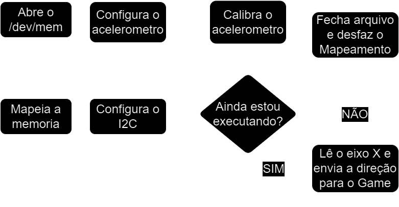

# Tetris na Placa DE1-SOC

*_Podemos Colocar uma Logo, como uma foto da tela inicial aqui_*


Nesse projeto foi desenvolvido um jogo *_TetrisLike_* para a plataforma DE1-SoC da Altera/Intel, com foco na integração hardware/software, onde foi preciso fazer a comunicação do acelerometro ADXL345 com o processador Dual-core ARM Cortex-A9. Com isso foi desenvolvido uma biblioteca para utilizar o acelerometro além de utilizarmos as bibliotecas já disponiveis da IntelFPGAUP para configurações de botoões, displays de 7 segmentos e exibição de video via VGA.

# <abbr title="Too Long Didn't Read">TL;DR</abbr>:

Caso você só esteja interessado em rodar o jogo, não precisa ler o texto todo:

- Este projeto se trata do desenvolvimento de um jogo baseado no famoso Tetris, para a placa DE1-SoC. Caso você tenha uma DE1-SoC em mãos, e com acesso à internet, basta colar o seguinte código no terminal:
```
git clone https://github.com/vini464/TETRIS_ON_DE1-SOC.git && cd TETRIS_ON_DE1-SOC
make game
```
> **Obs: Você precisa de privilégio de administrador para rodar o jogo.**

# Sumario

*_Adicionar links para cada topico e subtopicos aqui_*

# Como executar
Caso você só esteja interessado em rodar o jogo, não precisa ler o texto todo:

Para rodarmos o código, precisamos cumprir alguns requisitos que são:

 1. Uma Placa DE1-SoC.
 2. Linux instalados.
 3. As bibliotecas do IntelFPGAUP instaladas, mais especificamente a de Key, 7 segmentos e VGA.
 4. Um monitor com entrada VGA.
 5. Um cabo de Ethernet
 6. Um computador com terminal Linux para acessar a placa via protocolo SSH.

Com todos os requisitos cumpridos basta no computador acessar a placa via protocolo SSH com ambos conectados na mesma rede e transferir o arquivo desse repositoria via protocolo SCP. Caso possua conexão com a internet na placa, ao invés de usar SCP, basta digitar o seguinte código no terminal:
```
git clone https://github.com/vini464/TETRIS_ON_DE1-SOC.git && cd TETRIS_ON_DE1-SOC
make game
```
> **Obs: Você precisa de privilégio de administrador para rodar o jogo.**


# Desenvolvimento?
*_Podemos Colocar os diagramas gerais aqui_*

*_Queria colocar aqui uma explicação geral de como funciona e abaixo dele fazer detalhes para partes do programa, como é o caso do acelerometro logo abaixo, de qualquer forma, vou deixar escrito minha parte._*
  
O programa é divido em 3 threads, e podemos exemplificar como seu funcionamento se dar a partir delas.
- Acelerometro
  
  O acelererometro é um dos grandes protagonistas desse projeto, sendo assim, foi desenvolvido toda uma thread só para checka constantemente se houve uma atualização na direção, a função responsavel por identificar a direção se chama ```get_direction()```, na qual muda um valor para -1 (esquerda) caso o eixo X esteja menor que -35, 1 (direita) caso o eixo X esteja maior que 35, ou 0 (neutro) caso não esteja inclinado suficiente.

- Botões

  Os botões são essenciais para controlar o fluxo do programa e para garantirmos isso, ele possui tambem uma thread dedicada para o seu monitoramento. Os botões da placa DE1-SoC funcionam como um número binario de 4 digitos, onde o valor da key 0 é o digito menos significativo e o botão da key 3 é o mais significativo, sendo assim, foi necessario criar um logica para identificar quando cada bit especifico desse número muda e traduziro em um comando, a key 0 resulta em um pause, a key 1 caso o jogo esteja pausado reinicia-la o jogo e a key 2 caso o jogo esteja pausado ele vai encerrar o programa.

- Game

  


## Acelerometro

<div align="center">
  
  <p><em>Diagrama de aceleração final</em></p>
</div>

Podemos explicar o funcionamento do acelererometro atrávez do seguinte diagrama.

1. Abrir o Diretorio /dev/mem e mapea-la

   O arquivo especial /dev/mem representa a memória física do dispositivo. Ele é fundamental para acessarmos dispositivos de hardware, como o barramento I2C. Para abrir esse arquivo, usamos o comando ```open() ``` da biblioteca unistd.h em C.
   Para mapearmos a memoria utilizamos o comando ```mmap()``` usando o endereço 0xFFC04000 como endereço base, isso nos permite virtualizar endereços de memória físicos para o espaço de endereçamento do processo de usuário, nos dando a capacidade de ler e escrever diretamente nos registradores do I2C.

2. Configurar o I2C e Acelerometro
   
   Para configurar o I2C foi necessario criar funções para escrever nos registradores do I2C, feito isso, devemos configurar a comunição escrevendo nos seus registradores, entre os principais podemos citar o seu registrador de enable que define se está havendo alguma comunicação, seu registrador de comando(```I2C0_CON```) que configura como será o comportamento da comunicação, o registrador de target(```I2C0_TAR```) que define para onde a comunicação vai apontar, e seu registrador de dados(```I2C0_DATA_CMD```), que permite a leitura ou escrita de dados no acelerometro neste caso.
   Para escrever no acelerometro precisamos enviar um comando de start para o registrador DATA_CMD e esperar seu buffer ser esvaziado, no caso da leitura, adiciona-se o passo de enviar um pedido de leitura para então checkar seu buffer no registrador ```I2C0_RXFLR```.
   Conseguindo acessar os registradores do acelerometro, precisamos configurar-lo e ela se dar principalmente setando como vamos ler os dados no registrador ```DATA_FORMAT```, limiar de interrupções nos registradores ```THRESH_ACT```,```ACT_INACT_CTL``` e ```INT_ENABLE```, velocidade de leitura no registrador ```BW_RATE``` e modo de medição no ```POWER_CTL```.
5. Calibração e interrupção por movimento

   A calibração serve para estabelecermos uma posição inicial para a leitura do acelerometro, ela ocorre fazendo uma media de uma quantidade especificada de leituras dos eixos XYZ para então criarmos conseguirmos o offset que tornará aquela posição como a posição 0.
   Após calibrado, também foi estabelecido um limiar de movimentação, basicamente quanto devemos movimentar para identificar uma movimentação e assim fazer uma leitura, isso é configurado pelo ```THRESH_ACT``` e após alguns testes colocamos com 125mg, sendo g uma constante para a força da gravidade da Terra.


## Testes

## Conclusão
