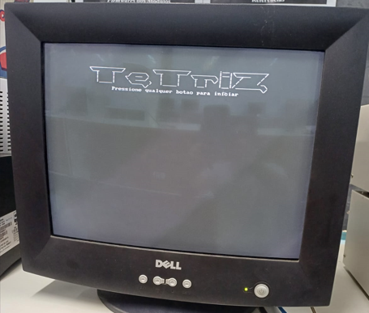
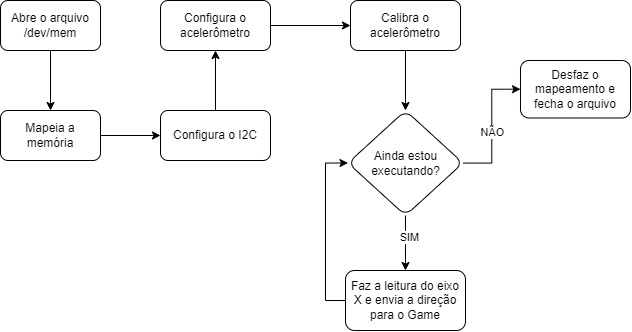
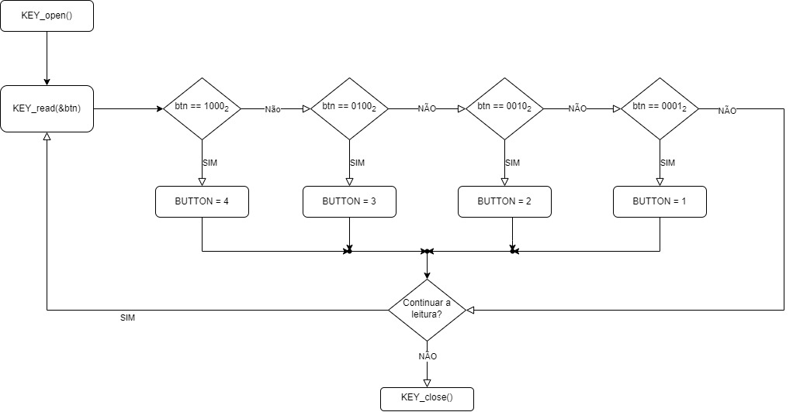
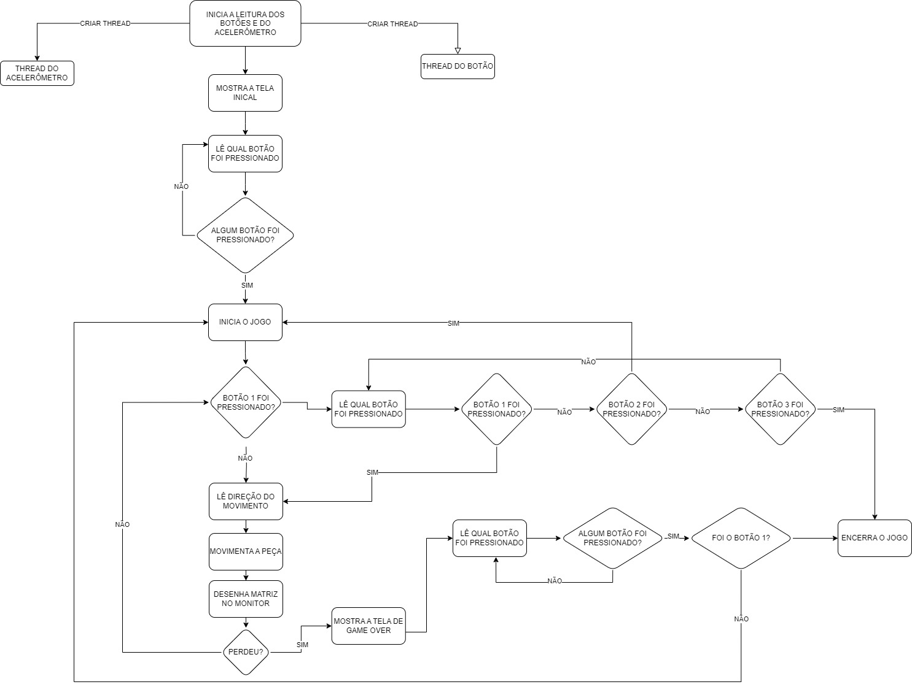
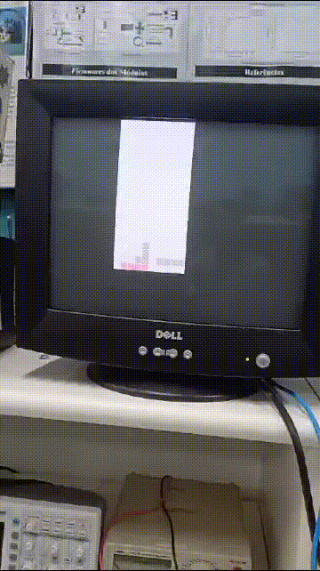
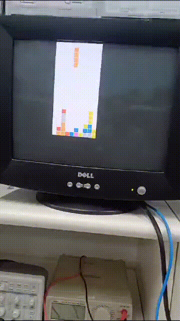
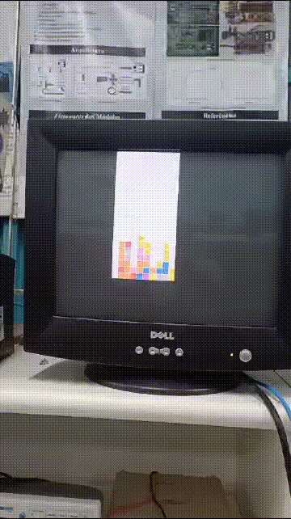

<div align="center">
    
    <p><em>TETRIZ</em></p>
</div>

# Sumario

- [Geral](#geral)
- [Requisitos](#requisitos)
- [Desenvolvimento](#desenvolvimento)
- [Acelerometro](#acelerometro)
- [Botões](#botões)
- [Game](#game)

- [Testes](#testes)
- [Como executar](#como-executar)

- [Conclusão](#conclusão)


# Geral

Nesse projeto foi desenvolvido um jogo *_TetrisLike_* para a plataforma DE1-SoC da Altera/Intel, com foco na integração hardware/software, onde foi preciso fazer a comunicação do acelerômetro ADXL345 com o processador Dual-core ARM Cortex-A9. Com isso foi desenvolvido uma biblioteca para utilizar o acelerômetro, além de utilizarmos as bibliotecas já disponíveis da IntelFPGAUP para interações com os displays de 7 segmentos, `interface VGA` e botões. 

# Requisitos

Alguns requisitos foram impostos para o desenvolvimento desse projeto, do ponto de vista de gameplay temos:
- O movimento do jogador deve ser capturado pelo acelerômetro presente na placa;
- O jogador deve ser capaz de `iniciar`, `pausar`, `continuar` e `sair`.
- O jogo deve pontuar e eliminar agrupamentos;
- O jogador não pode mudar a orientação das peças.

Além disso, temos limitações do ponto de vista de produção:

- Os códigos devem ser escritos em linguagem C;
- O sistema só poderá utilizar os componentes presentes na placa;
- Não é permitido o uso de bibliotecas para o acelerômetro;
- A exibição do jogo deverá ser realizada através da `interface VGA`.

# Desenvolvimento

Para melhor compreensão, nosso sistema foi dividido em três partes: `controle do jogador`, `lógica do jogo` e `exibição`.

Na camada de `controle do jogador` nós tivemos que trabalhar com o acelerômetro para a movimentação do jogador e decidimos utilizar os botões para as ações: `iniciar`, `pausar`, `continuar`, `reiniciar` e `sair`. Caso queira ver com mais detalhes como cadas implementação funciona, veja: [botões](#botões) [Acelerômetro](#acelerometro).

Para a `lógica do jogo` temos uma matriz que simbolizar o `tabuleiro` do jogo, nele nós guardamos apenas a informação de qual cor está em cada quadrado (0 significa que aquele espaço está vazio). Além disso, temos uma estrutura de `peça` que inidica a posição e a cor de cada peça. Para o jogo ter sentido, implementamos funções que movem `peças` no `tabuleiro`, ou seja, movem a cor da matriz que está na posição indicada pela estrutura. Também temos uma função para limpar uma linha completa (e calcular a pontuação obitida) e uma função que adiciona gravidade (no sentido físico) ao jogo. 

Por fim temos a camada de `exibição`. Nela nós utilizamos os displays de 7 segmentos para mostrar a pontuação para o usuário, e a `interface VGA` para exibir o jogo. veja: [VGA](#vga).

## Acelerometro

<div align="center">
    
    <p><em>Figura accel: Diagrama do acelerometro </em></p>
</div>

Para nos aprofundarmos mais de como exatamente funciona o acelerômetro podemos nos guiar pelo diagrama acima, e então atráves desses passos explicar boa parte do que foi usado para chegarmos no resultado descrito esperado.

1. Abrir o Diretório /dev/mem e mapeá-la

   O arquivo especial /dev/mem representa a memória física do dispositivo. Ele é fundamental para acessarmos dispositivos de hardware, como o barramento I2C. Para abrir esse arquivo, usamos o comando `open()` da biblioteca unistd.h em C.
   Para mapearmos a memória utilizamos o comando `mmap()` usando o endereço 0xFFC04000 como endereço base, isso nos permite virtualizar endereços de memória físicos para o espaço de endereçamento do processo de usuário, nos dando a capacidade de ler e escrever diretamente nos registradores do I2C.

2. Configurar o I2C e Acelerômetro

   Para configurar o I2C foi necessário criar funções para escrever nos registradores do I2C, feito isso, devemos configurar a comunicação escrevendo nos seus registradores, entre os principais podemos citar o seu registrador de enable que define se está havendo alguma comunicação, seu registrador de comando(`I2C0_CON`) que configura como será o comportamento da comunicação, o registrador de target(`I2C0_TAR`) que define para onde a comunicação vai apontar, e seu registrador de dados(`I2C0_DATA_CMD`), que permite a leitura ou escrita de dados no acelerômetro neste caso.
   Para escrever nele precisamos enviar um comando de start para o registrador DATA_CMD e esperar seu buffer ser esvaziado, no caso da leitura, adiciona-se o passo de enviar um pedido de leitura para então checar seu buffer no registrador `I2C0_RXFLR`.
   Conseguindo acessar os registradores do acelerômetro, precisamos configurá-lo e ela se dar principalmente setando como vamos ler os dados no registrador `DATA_FORMAT`, limiar de interrupções nos registradores `THRESH_ACT`,`ACT_INACT_CTL` e `INT_ENABLE`, velocidade de leitura no registrador `BW_RATE` e modo de medição no `POWER_CTL`.
5. Calibração e interrupção por movimento

   A calibração serve para estabelecermos uma posição inicial para os eixos XYZ, ela ocorre fazendo uma média de uma quantidade especificada de leituras deles para então criarmos conseguirmos o offset que tornará aquela posição da placa como a posição 0 (ou muito próxima disso).
   Após calibrado, também foi estabelecido um limiar de movimentação, basicamente quanto devemos movimentar para identificar uma movimentação e assim fazer uma leitura, isso é configurado pelo `THRESH_ACT` e após alguns testes colocamos com 125mg, sendo g uma constante para a força da gravidade da Terra.

Sendo assim, foi desenvolvido toda uma thread só para observar constantemente se houve uma atualização na direção, a função responsável por identificar a direção se chama `get_direction()`, na qual muda um valor para -1 (esquerda) caso o eixo X esteja menor que -35, 1 (direita) caso o eixo X esteja maior que 35, ou 0 (neutro) caso não esteja inclinado suficiente.

## Botões

Os botões são essenciais para controlar o fluxo do programa e para garantirmos isso, ele também possui uma thread dedicada para o seu monitoramento. Os botões da placa DE1-SoC são lidos como um número de 4 bits, onde o menos significativo representa o botão mais à direita e o mais significativo representa o mais à esquerda. Sendo assim, foi necessario criar um lógica para identificar quando cada bit específico desse número muda e indicar para função principal qual botão foi pressionado para que seja feia a ação correspondente (veja [Game](#game))

<div align="center">
    
    <p><em>Figura btns: Diagrama dos botões </em></p>
</div>

## VGA

## Game

Aqui é onde nós integramos todas as camadas que implementamos, podemos entender seu funcionamento por meio do seguinte fluxograma:

<div align="center">
    
    <p><em>Figura btns: Diagrama do jogo </em></p>
</div>


# Testes

1. Teste de movimentação


2. Teste da quebra de linha

   
3. Teste do pause

   
4. Teste de reiniciar

    
5. Teste de desligar

    
6. Teste de game over

    

# Como executar

Para rodarmos o código, precisamos cumprir alguns requisitos que são:

1. Uma Placa DE1-SoC.
2. Linux instalados.
3. As bibliotecas do IntelFPGAUP instaladas, mais especificamente a de Key, 7 segmentos e VGA.
4. Um monitor com entrada VGA.
5. Um cabo de Ethernet
6. Um computador com terminal Linux para acessar a placa via protocolo SSH.

Com todos os requisitos cumpridos basta transferir os arquivos desse repositório para a placa. E então entrar na pasta do projeto e rodar o comando `make game`.

Caso sua placa tenha acesso a internet, e o git instalado, você pode digitar o seguinte comando: 
Clone o repositório:
```
git clone https://github.com/vini464/TETRIS_ON_DE1-SOC.git && cd TETRIS_ON_DE1-SOC
make game
```
> **Obs: Você precisa de privilégio de administrador para rodar o jogo.**
# Tecnologias utilizadas:
Para o desenvolvimento desse projeto, utilizamos as seguintes tecnologias e ferramentas:

- Editores de texto:
<br>
<br>
- Linguagem:
<br>
- Sistema Operacional:


# Conclusão

Foi desenvolvido um jogo semelhante ao Tetris funcional e divertido com mecânicas adicionais como a de gravidade nos blocos. Para isso foi preciso entender conceitos de como o hardware e o software interagem, conhecimentos do sistema operacional Linux e principalmente como ele gerencia a memória com a finalidade de podermos fazer a virtualização dela, aprimorar o conhecimento na linguagem C e obter um domínio básico sobre a placa DE1-SoC e suas ferramentas, bibliotecas e estrutura. 
